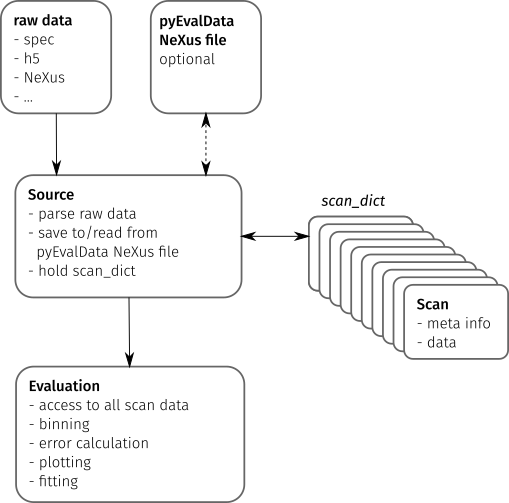

# User Guide

The idea of the `pyEvalData` module is to provide a simple but yet flexible way
for reading and evaluating scientific data acquired at synchrotrons, FELs, or
in the lab. It is written with the intend to reuse available code as much as
possible and to simplify the access to complex data formats and very general
evaluation and analysis procedures. Generally, students and scientists should
focus on data interpretation rather than on scripting the same routines again
and again.

Please read the upcoming section to understand the concept of reading and
evaluating data with `pyEvalData` and how to extend/configure the module to
your needs.

It is also strongly recommended to follow the [examples](examples) which can
also be run locally as `jupyter` notebooks. More details can be found in the
[API documentation](api) of the individual sub-modules and classes.

## General Concepts

The following figure illustrates the main components of the `pyEvalData` module
and their interactions.



### Raw Data

The starting point of most evaluations is any set of raw data files as
generated by an experimental setup consisting of actuators such as motors and
counters such as detectors, cameras, or sensors.

Typical data formats are human readable text files or compressed
[hdf5](https://www.hdfgroup.org/solutions/hdf5/) or
[NeXus](https://www.nexusformat.org/) files. Cameras often use `tiff` or
proprietary file formats.

### Source

The `Source` class provides a common set of methods and attributes to read and
store raw data. It further acts as an `interface` to implement the
source-specific classes.

A `Source` class should be able to parse the raw data to detect all available
scans e.g. in a data file or folder structure and to extract the scan's meta
information such as a *scan number* or *scan command*.
The actual data for a scan must be read by an independent method.

The scan meta information and possibly also the scan data are stored in a
`Scan` object, which provides a general but flexible interface between the
`Source` and `Evaluation` classes. All `Scan` objects of a raw data source are
stored in the `scan_dict` attribute of the `Source` object.

The `pyEvalData` modules provides several build-in `Source` classes, e.g. for 
[spec](https://certif.com/content/spec/),
[hdf5](https://www.hdfgroup.org/solutions/hdf5/), and
[NeXus](https://www.nexusformat.org/) files. It can be easily extended by the
user as explained in the
[write your own `Source` section](#write-your-own-source).
It is highly appreciated if new `Source` plugins are shared with the community.

In a future release, it will be possible to join two or multiple `Source`
classes to create a `CompositeSource` object. This will be helpful to read
separate raw data sources originating from the same experiment. A typical
example is a scan file, such as a [spec](https://certif.com/content/spec/) file
and a  folder structure containing camera images, which are linked to the data
points in the scan file. 

### pyEvalData NeXus file

A rather general feature of the `pyEvalData` module is the usage of a
[NeXus](https://www.nexusformat.org/) file for converting the raw data in a
common, structured, fast, and compressed data format. If enabled, the user can
benefit from:
- a single data file containing all raw data - easy portability
- high degree of compression - saves disk space
- fast data access - saves computational time
- common and well documented structure - easy access also by external tools 

### Evaluation

The `Evaluation` class requires any kind of `Source` on initialization. Hence
it has access to all available scans in the `scan_dict`. In addition to all
available meta information and raw data, it allows for defining additional
`counters` by user-defined algebraic expression, which can also handle nested
expressions. 

Variable injection of pre- and post-filter for the raw and evaluated data,
respectively, enables to simplify common procedures such as outlier removal,
offset removal, or normalization. In a future release, the filters will be
provided as dedicated objects inheriting from a base `Filter` class. It will be
possible to concatenate multiple filters and again a set of common filters will
be available in the `pyEvalData` module, while adding new user-defined filters
is explained in the [write your own `Filter` section](#write-your-own-filter).

Further features of the `Evaluation` is to handle the *averaging* of multiple
scans. Here, the case of multiple datasets with different $x$-grids is a very
common but yet complex scenario. The `Evaluation` class will **never**
interpolate any data, because one should avoid the *generation* of data-points.
Instead, the data will be always *binned* onto an automatically-generated or
user-defined $x$-grid. The underlying algorithm take also care of the correct
error-calculations and can handle error-propagation as well as
[Possion statistics](https://en.wikipedia.org/wiki/Poisson_distribution)
as required for 
[single-photon-counting](https://en.wikipedia.org/wiki/Photon_counting) data.

Finally, the evaluated data can be easily plotted as well as fitted based on
the [`matplotlib`](https://matplotlib.org/) and
[`lmfit`](https://lmfit.github.io/lmfit-py/) modules. As a very common task it
is easily possible to do the plotting and fitting for a sequence of one or
multiple scans in dependence of an external parameter, such as a temperature
series or alike.

## Write your own `Source`

All you need to do is to define your own class which inherits from the `Source`
class of the `pyEvalData` module. You can do so also directly in your
evaluation script following this example containing some pseudo-code.

```python
import pyEvalData as ped

class MyDataSource(ped.io.Source):
    """MyDataSource

    Here you should copy and adapt the doctring from the ``Source`` class for
    proper documentation

    """    
    def __init__(self, file_name, file_path='./', **kwargs):
        super().__init__(file_name, file_path, **kwargs)

    def parse_raw(self):
        """parse_raw

        Parse the raw source file/folder and populate the `scan_dict`.

        """
        raw_scans = parse_my_raw_data(self.file_name, self.file_path)
        for rs in raw_scans:
            # create the Scan from the meta information
            scan = ped.io.Scan(int(rs.nr),
                               cmd=rs.command,
                               date=rs.date,
                               time=rs.time,
                               int_time=rs.int_time,
                               header=rs.header,
                               init_mopo=rs.init_motor_pos)
            # store the scan in the scan_dict
            self.scan_dict[spec_scan.nr] = scan

            # check if the data needs to be read as well, if not it will be
            # read on demand later
            if self.read_all_data:
                self.read_scan_data(self.scan_dict[spec_scan.nr])

    def read_raw_scan_data(self, scan):
        """read_raw_scan_data

        Reads the data for a given scan object from raw source.

        Args:
            scan (Scan): scan object.

        """
        # read the actual data
        raw_scan_data = read_my_raw_scan_data(scan.number)
        # set the data of the scan object
        scan.data = raw_scan_data

```

## Write your own `Filter`

comming soon ...